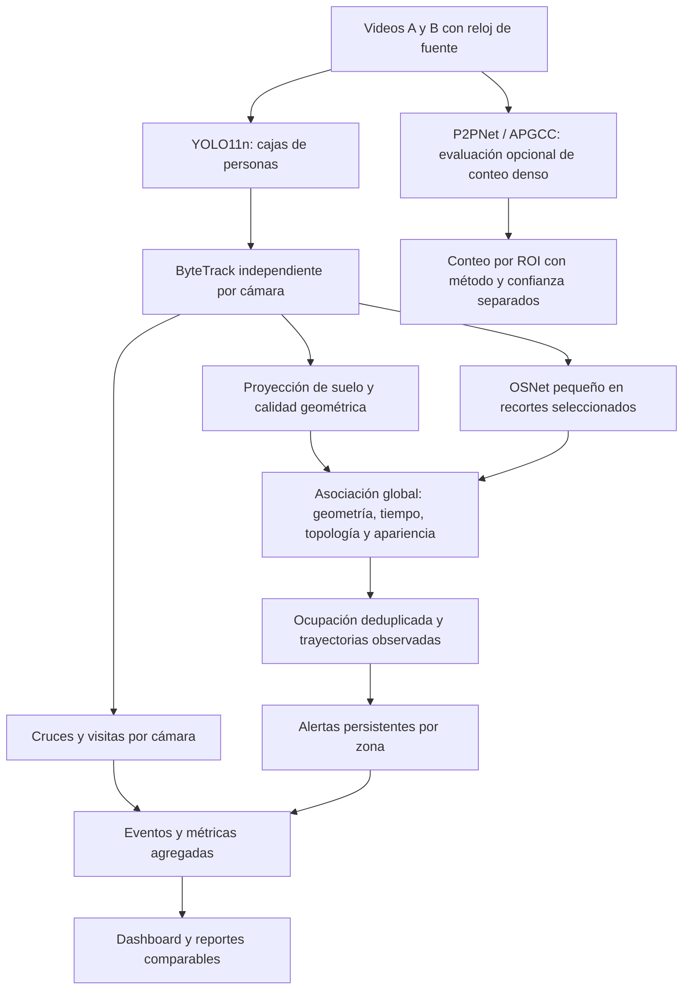

# Propuesta técnica de AeroTrack

> **Nota (2026-10-05).** Esta propuesta es anterior a la simplificación del proyecto. Desde esa fecha no se usa P2PNet (la ocupación y las aglomeraciones salen del seguimiento con YOLO), hay un solo motor de identidad y no se configura alcance de cámaras. Lo vigente está en `docs/ARQUITECTURA.md`.

## 1. Decisión de arquitectura y alcance

AeroTrack debe construirse como un sistema de analítica de afluencia con seguimiento temporal multicámara. Su objetivo es estimar dónde y cuándo se concentran las personas, medir cruces y entradas a zonas comerciales, y enlazar recorridos entre cámaras vecinas cuando exista evidencia suficiente. El primer escenario es un conjunto de videos propios de dos cámaras fijas; la validación con cámaras de LAP es una etapa posterior, sujeta a disponibilidad y autorización.

Para un equipo universitario con laptops sin GPU y ocho semanas de trabajo, la configuración inicial recomendada es **YOLO11n preentrenado + ByteTrack de cajas por cámara + homografía de suelo + asociación multicámara por tiempo, geometría y apariencia con OSNet pequeño + eventos de entrada/salida + ocupación y alertas por zona**. ByteTrack y la asociación multicámara son componentes diferentes. OSNet se incorpora después de medir la línea base geométrica, ejecutándolo sobre recortes seleccionados y reutilizando sus descriptores; no sobre todas las personas en todos los frames.[^1][^2][^3]

P2PNet se conserva como referencia de conteo denso. APGCC es el candidato adicional para una comparación acotada de conteo; CSRNet sirve como antecedente de mapas de densidad y P2R como extensión de entrenamiento semi-supervisado. Ninguno es obligatorio para que funcionen los cruces de puertas o el seguimiento de personas visibles.[^4][^5][^6][^7]

Esta es una decisión de ingeniería bajo restricciones de tiempo y cómputo, no una afirmación de que YOLO11n o ByteTrack sean los mejores modelos universales. La configuración final se seleccionará con clips anotados y tiempos medidos en las laptops. No se promete procesamiento de dos cámaras en tiempo real antes de esas mediciones.

**Nombre propuesto:** «AeroTrack: estimación de aglomeraciones y análisis de flujo peatonal mediante seguimiento multicámara para entornos aeroportuarios».

**Objetivo general propuesto:** desarrollar y evaluar un prototipo de visión computacional que estime ocupación y episodios de aglomeración, mida flujo peatonal y entradas a zonas de interés, y asocie trayectorias temporales entre cámaras fijas, utilizando videos de prueba y un protocolo transferible a un piloto con LAP.

**Objetivos específicos:** comparar métodos de detección y seguimiento; validar la calibración y sincronización; medir entradas, salidas y permanencia observada; evaluar asociaciones multicámara con rechazo de ambigüedad; y presentar resultados reproducibles con sus limitaciones.

La demostración mínima debe incluir dos cámaras, una región de solape, una transición con intervalo sin cobertura, una puerta simulada y dos zonas de interés. Los pasos por puerta, los retornos y los cambios de identidad deben poder comprobarse manualmente. La evaluación de alta densidad puede realizarse adicionalmente con un dataset público; una grabación de cinco compañeros no valida el comportamiento ante cientos de personas.

## 2. Qué significa cada resultado

| Resultado | Definición operativa | Qué no demuestra |
|---|---|---|
| Ocupación | Personas estimadas presentes en una zona en un instante | Cantidad de entradas durante una hora |
| Densidad física | Ocupación dividida entre superficie útil medida en m² | Un mapa de colores en píxeles no es automáticamente personas/m² |
| Aglomeración | Superación sostenida de una regla de ocupación o densidad por zona | Peligro, pánico o cola problemática por sí sola |
| Flujo | Cruces direccionales de una puerta o sección por intervalo | Promedio de personas visibles |
| Entrada comercial | Cruce exterior-interior de un acceso definido | Compra o conversión de ventas |
| Permanencia observada | Tiempo de observaciones atribuibles a una trayectoria dentro de una zona | Duración real completa si hubo pérdida de seguimiento |
| Visitas | Eventos de entrada; una persona puede generar varios | Personas únicas de todo un día |
| Continuidad multicámara | Asociación estimada entre segmentos de trayectoria | Identificación civil o recuperación infalible después de largos huecos |

La ocupación acumulada se puede expresar como personas × segundos: `S_z = suma(N_z(t) * delta_t)`. Si 10 personas permanecen 60 segundos, producen 600 personas·s. Si 100 personas pasan 2 segundos, producen 200 personas·s. El primer sector tiene más permanencia acumulada y el segundo más tránsito. Por eso un único mapa de calor no responde ambas preguntas.

Para proponer una ubicación comercial, mostrar separadamente tránsito frente al sector, tiempo de observación válido, permanencia, entradas a locales cercanos y variación horaria. Comparar intervalos equivalentes y registrar periodos sin cámara. La decisión de abrir una tienda necesita además información de accesibilidad, espacio disponible y negocio que el video no proporciona.

## 3. Conteo, cabezas y tracking: resolución de las dudas

**CSRNet sí cuenta.** Produce un mapa de densidad cuya suma, con la normalización correcta, estima el número de personas. No entrega por sí mismo una lista de identidades ni trayectorias. Un mapa por frame permite analizar cambios de ocupación; no permite concluir qué persona entró a una tienda.[^4]

**P2PNet cuenta y localiza puntos de cabeza.** Las salidas de dos frames no incluyen una correspondencia temporal garantizada. Se puede añadir un tracker de puntos, como el que ya existe en el proyecto, pero la robustez ante oclusiones y cruces es un problema adicional. No es inmune a multitudes, cambios de perspectiva o errores de detección.[^5]

**P2R es una propuesta de pérdida y supervisión semi-supervisada para conteo por puntos.** No debe compararse directamente con un tracker como si resolvieran la misma tarea. Es pertinente si la pregunta de investigación es reducir anotaciones para adaptar un contador. Una cifra como «5 % de etiquetas» requiere indicar el dataset, el protocolo y qué unidad se etiqueta; no es una garantía general para LAP.[^7]

**No es obligatorio detectar cuerpos completos para hacer seguimiento.** Existe investigación específica en seguimiento de cabezas, como CroHD/Head Tracking 21. Lo que cambia es la evidencia disponible: una cabeza pequeña puede dar buena localización en una multitud y poca información de apariencia para enlazar vistas diferentes.[^8]

**El descriptor de apariencia tampoco garantiza identidad.** OSNet compara características visuales de recortes de personas. Cambios de ángulo, uniformes, oclusiones y baja resolución pueden producir falsos emparejamientos. Su salida se combina con restricciones de cámaras, tiempo y espacio; no se interpreta como una identidad real.[^3]

**Una homografía de suelo no proyecta correctamente una cabeza al suelo.** Se calibra con puntos de un plano físico. Usar la posición de la cabeza como si fuera la del pie genera sesgo por perspectiva. Para el núcleo se utiliza el centro inferior de la caja como aproximación del apoyo, con incertidumbre cuando el cuerpo esté ocluido o truncado. Una alternativa basada en cabezas necesita geometría adicional o mantener los resultados en coordenadas de imagen.[^9]

**La compensación de movimiento del tracker no arregla la calibración del mapa.** Si se mueve la cámara, la homografía fija deja de representar la misma vista aunque el tracker mantenga IDs. Por eso las grabaciones deben hacerse con soporte fijo, sin zoom y sin cambios de encuadre.

## 4. Selección de literatura y algoritmos

La revisión combina papers fundacionales, trabajos recientes y repositorios de autores. Se consultó Hugging Face Trending como punto de descubrimiento; su popularidad no equivale a un ranking de calidad para este caso. La selección no es una revisión sistemática exhaustiva de toda la literatura ni un benchmark ejecutado por el proyecto. Fecha de consulta: 14 de septiembre de 2026.

| Trabajo | Publicación | Aporte relevante | Decisión para AeroTrack |
|---|---|---|---|
| CSRNet | CVPR 2018 | Conteo con mapa de densidad | Antecedente y baseline opcional; no motor de tracking |
| P2PNet | ICCV 2021 | Conteo y localización por puntos | Conservar como baseline denso existente |
| APGCC | ECCV 2024 | Mejora del aprendizaje de propuestas de puntos | Comparación opcional prioritaria frente a P2PNet |
| P2R Loss | CVPR 2025 | Conteo por puntos con supervisión parcial | Posponer; no entrenar desde cero en CPU |
| ByteTrack | ECCV 2022 | Asociación que reutiliza detecciones de baja confianza | Tracker principal inicial de cajas |
| BoT-SORT | Preprint 2022 y código de autores | Movimiento, apariencia y compensación de cámara | Comparador de tracking, no requisito inicial |
| OC-SORT | CVPR 2023 | Asociación centrada en observaciones ante oclusión y movimiento no lineal | Comparador ligero prioritario |
| Deep OC-SORT | ICIP 2023 | OC-SORT con apariencia adaptativa | Alternativa posterior si mejora IDF1 a costo aceptable |
| OSNet | ICCV 2019 | Descriptor de apariencia multiescala | Encoder pequeño para asociación entre cámaras |
| Tracking Pedestrian Heads in Dense Crowd | CVPR 2021 | Tracking de cabezas y dataset CroHD | Referencia si las vistas muestran principalmente cabezas |
| Geometric Consistency and State-aware Re-ID Correction | CVPR Workshops / AI City 2024 | Geometría y corrección de apariencia en tracking multicámara | Referencia principal para diseñar el asociador global |
| TrackTrack | CVPR 2025 | Asociación e inicialización enfocadas en tracks | Candidato reciente si sobra tiempo de comparación |
| DragonTrack | WACV 2025 | Detector transformer y asociación mediante grafos | Antecedente; no adoptarlo sin medir costo |
| MOTE | ICML 2025 | Tracking ante oclusiones con transformer y flujo óptico | Antecedente; fuera de la implementación obligatoria |
| RF-DETR | ICLR 2026 | Detector transformer con búsqueda de configuraciones precisión-latencia | Alternativa de detector en experimento corto, no migración obligatoria |
| UMPN / One Graph to Track Them All | Preprint 2025 en las fuentes consultadas | Grafo para seguimiento mono y multivista; SCOUT | Línea futura de asociación aprendida |

Fuentes de las filas: conteo [^4][^5][^6][^7]; tracking [^2][^10][^11][^12][^13]; apariencia y cabezas [^3][^8]; multicámara [^14][^18]; alternativas recientes [^15][^16][^17]. Los trabajos de AI City publicados en Workshops se citan como tales; no como artículos de la conferencia principal.

La conversación de Google menciona DragonTrack y MOTE: ambos existen. Eso no prueba que sean los líderes actuales para un aeropuerto ni que cualquier transformer necesite «GPUs masivas». La recomendación de posponerlos se debe al plazo, la integración y la falta de mediciones propias, no a una imposibilidad absoluta de ejecutarlos. Black Re-ID también existe, pero un trabajo de descriptor cabeza-hombros no prueba reidentificación fiable de cabezas pequeñas en las cámaras disponibles.[^15][^16][^19]

Hay novedades posteriores a YOLO11, incluida YOLO26, y RF-DETR tiene publicación en ICLR 2026. YOLO11n se elige como baseline por continuidad con el código, no por ser la versión más nueva. La documentación actual de Ultralytics también incluye más trackers que los mencionados en la conversación de Google: se deben fijar versión y configuración, nunca depender del tracker predeterminado.[^1][^17][^20][^21]

## 5. Arquitectura implementable en CPU



### Detector y tracker local

Comenzar con YOLO11n en CPU, resolución de inferencia inicial de 640 y una comparación a mayor resolución en clips con personas pequeñas. Esta resolución es un punto de partida, no un valor óptimo conocido. Mantener las cajas completas para ByteTrack y transportar el índice de detección asignado a cada track hasta la extracción de apariencia y visualización.

Mantener un estado independiente por cámara. No intercalar dos fuentes en un único tracker. Coordinar el umbral del detector con los umbrales alto/bajo del tracker: si el detector descarta todas las cajas de baja confianza antes de entregarlas, se pierde parte del beneficio de ByteTrack.[^2]

En CPU, empezar con reproducción offline que preserve el tiempo de fuente. Comparar muestreo a 5 y 10 FPS con segmentos más densamente muestreados; en cada configuración volver a evaluar cruces y continuidad. El tiempo de buffer y las velocidades deben tener unidades explícitas. En un tracker externo se debe respetar su convención temporal y fijar el FPS efectivo; si se implementa un filtro con intervalos variables, actualizar tanto transición como ruido de proceso con `delta_t`.

No confundir FPS del archivo, FPS de inferencia y velocidad de procesamiento del conjunto de cámaras. Si un minuto de fuente tarda dos minutos en procesarse, el resultado es offline a 0.5×, no tiempo real. Los reportes deben seguir usando un minuto de tiempo de fuente.

### Asociación multicámara

Construir tracklets: segmentos con cámara, ID local, inicio/fin, última posición observada, velocidad, calidad de proyección y una pequeña galería temporal de apariencia. Usar inicialmente OSNet `x0_25` con pesos entrenados para ReID, no solamente pesos ImageNet. El catálogo oficial ofrece variantes pequeñas; su precisión en los datasets de origen no garantiza transferencia al aeropuerto.[^3][^22]

En **solape**, comparar observaciones contemporáneas en el suelo. Dos vistas de la misma persona representan una sola contribución de ocupación. Un ID global puede tener simultáneamente una observación en A y otra en B, pero no dos personas distintas en A. Resolver inconsistencias espaciales y limitar las fusiones transitivas incompatibles.

En **zonas sin solape**, exigir que una salida por una región de A sea compatible con una entrada por una región de B dentro de un intervalo plausible. El tiempo puede imponer límites mínimo y máximo por enlace. Comparar apariencia de varios recortes fiables y usar dirección; no extrapolar indefinidamente una línea recta a través de paredes o tiendas.

Aplicar primero restricciones duras y luego un costo combinado de distancia, tiempo y apariencia, normalizado por sus escalas. Resolver asignaciones por lote, con correspondencia uno a uno y margen entre el mejor y el segundo candidato. Los pesos y márgenes se ajustan en validación. La distancia de embedding no debe presentarse como porcentaje de confianza sin calibración probabilística.

Incluir estados «asociación estimada», «incierta» y «sin asociación». No inventar posiciones durante un hueco. Los tracks sin candidato aceptable conservan un ID nuevo; el sistema debe poder abstenerse. Si se introduce espera de algunos frames para resolver una transición, se declara la latencia y se separa de una evaluación estrictamente causal. Esta propuesta sigue principios de geometría más apariencia presentes en sistemas multicámara publicados, sin atribuirles garantía de funcionamiento en LAP.[^14]

### Conteo denso complementario

Ejecutar P2PNet inicialmente en imágenes o frames seleccionados. Compararlo con APGCC si el calendario permite completar inferencia reproducible. Si YOLO mantiene el error de conteo dentro de los objetivos acordados en las escenas de uso, no añadir otra red al producto principal.

Si los cuerpos no son distinguibles, un contador especializado puede dar una estimación por ROI aunque no existan trayectorias fiables. El dashboard debe indicar «conteo estimado sin seguimiento individual». No sumar `conteo de cabezas + tracks de cuerpos` sobre las mismas personas y no sumar conteos de cámaras superpuestas. Para la primera versión, asignar una cámara de referencia a cada ROI densa; una fusión multivista de densidades sería otro desarrollo.

## 6. Entradas a tiendas, flujo y alertas

Para una tienda, definir una línea finita orientada y dos zonas a sus lados: exterior e interior. Crear un evento de entrada solo cuando una trayectoria observada pasa del lado exterior al interior atravesando el segmento, con confirmación temporal. Usar banda de tolerancia e histéresis para que el ruido en el borde no cuente varias entradas. Definir el evento inverso como salida.

La lógica debe manejar personas detenidas en la puerta, retornos, grupos y pérdida de observación. Un track que aparece directamente dentro de la tienda tiene entrada desconocida, no entrada confirmada. No deducir un cruce a través de un hueco largo solo por interpolar dos puntos. La regla «permaneció cinco segundos en un polígono» mide permanencia bajo ese criterio, no necesariamente entrada.

Una persona que entra, sale y vuelve a entrar produce dos visitas. «Visitantes únicos estimados en una sesión» requiere mantener y evaluar identidad durante ese intervalo; no se prometerán únicos de todo un día ni entre jornadas. Para contar cruces en una puerta no es obligatorio resolver la identidad multicámara de todo el aeropuerto.

Las métricas mínimas por local son entradas, salidas, cruces ambiguos, tiempo de observación válido, permanencia observada cuando se vea el interior y proporción de trayectorias incompletas. Si solo se ve la puerta, no reportar tiempo completo dentro del local como si estuviera observado. La razón entradas/pasos frente al local se denomina tasa de captación observada; no conversión de ventas y no porcentaje de personas únicas salvo deduplicación válida.

Para aglomeración, mantener reglas por zona: `N_z >= umbral` durante `T` segundos y, cuando exista escala física, una alternativa basada en `N_z / area_util`. Los límites se acuerdan con el caso operativo; no se inventan umbrales de seguridad universales. Una alerta necesita ID de episodio, hora inicial/final, zona, máximo observado, duración y método de conteo.

Las agrupaciones circulares actuales pueden conservarse como visualización exploratoria. DBSCAN podría compararse si hace falta delimitar grupos de forma irregular, pero no es necesario para responder cuándo una zona supera un umbral. Ninguno de estos agrupamientos separa por sí solo una cola normal de una congestión problemática.

## 7. Auditoría del prototipo actual

El análisis corresponde a los fuentes de `proyecto_lap_prototipo` revisados en la rama `implementacion-modelos-algoritmos`. Se distingue implementación visible en código de exactitud demostrada en videos. La compilación TypeScript/Vite se verificó en la revisión anterior. Las pruebas de Python no pudieron cargarse con el intérprete entonces seleccionado porque faltaba `cv2`; no se ha demostrado en esta revisión una precisión real del sistema.

| Componente y ubicación | Estado comprobado por lectura | Cambio propuesto |
|---|---|---|
| `dashboard/src/aero/` | Interfaz de cámaras, configuración, plano, laboratorio, reglas y reportes | Conservar; añadir métricas de cruces, cobertura temporal y método |
| `live_server.py:177-221` | YOLO usa el mismo `ByteTrackPuntos` que la adaptación de cabezas | Introducir tracker de cajas y adaptadores separados |
| `live_server.py:270` | YOLO con confianza .15 e inferencia a 960 | Externalizar resolución, confianza, backend y tamaño de modelo; medir CPU |
| `live_server.py:300-301` | Reconstruye caja por detección más cercana al punto filtrado | Propagar la asignación real track-detección; evita asociar ropa/caja de otro individuo |
| `src/tracking.py` | Kalman con paso de predicción fijo, distancias en píxeles y expiración en frames | Mantener como baseline de puntos, documentar unidades; dejar de usarlo como tracker general de cajas |
| `src/live_core.py:150` | Asociación incremental por posición, tiempo, enlaces y color | Incorporar tracklets, apariencia aprendida, asignación por lote y calidad geométrica |
| `src/live_core.py:122` | Ajuste homográfico y comprobación sobre los mismos pares | Añadir puntos de validación independientes, residuales y control de cambios de encuadre |
| `src/spatial_scope.py` | Máscaras y exclusiones antes de generar IDs | Conservar y comprobarlas con reflejos y bordes |
| `src/live_core.py:254` | Ocupación, personas·s, reglas persistentes y deduplicación por ID global | Conservar; separar certeza, cobertura y origen de conteo |
| `src/live_reports.py:25-35` | «Flujo» es promedio/pico de personas presentes por hora relativa | Renombrar esa serie a ocupación temporal y crear flujo por eventos |
| `src/live_core.py:329` | `visits` usa IDs que aparecieron en una zona | Separar visitas, entradas y únicos estimados; IDs fragmentados sesgan el indicador |
| `src/live_metrics.py:21-23` | Alertas acumuladas por aumento del número simultáneo | Contar inicios de episodios; una alerta que sustituye a otra no debe perderse |
| `src/live_metrics.py` | Serie limitada a 3600 muestras y estado en memoria | Guardar agregados y metadatos por sesión para comparaciones posteriores |
| `live_server.py:234-350` | Muestreo de archivos en pasos de 0.2 s; inferencia secuencial | Medir capacidad, parametrizar el paso, registrar desfase y tiempo efectivo |
| `live_server.py:498` | Videos subidos escritos en `data/uploads` | Definir borrado y distinguir carga de archivo de grabación automática |
| `live_server.py:341,368` | Conserva previews con overlays de IDs tras finalizar | Limpiar overlays/frames si se anuncia eliminación de identificadores |
| `main.py` y `src/cross_camera.py` | Pipeline histórico separado, P2PNet y persistencia propia | Mantener como experimento; usar un único motor canónico para el producto |
| `tests/` | Pruebas de lógica, servidor y geometría | Añadir evaluación con anotaciones reales y pruebas de cruces/episodios |

La búsqueda del candidato global es secuencial: no debe describirse como una asignación global óptima. La deduplicación depende de que la asociación funcione; si la misma persona conserva dos IDs entre cámaras, el conteo global puede duplicarse. Tampoco basta que la interfaz diga «sincronización verificada»: hay que medir el desfase de contenido.

No hace falta rehacer React ni migrar a microservicios para corregir estas brechas. Separar responsabilidades dentro de Python permite mejorar el motor conservando las pantallas. SQLite para agregados y eventos es suficiente para esta entrega local; el pipeline histórico tiene persistencia, pero la consola actual no reutiliza automáticamente esa base.

## 8. Organización propuesta del código y los datos

La siguiente estructura describe archivos por implementar, no componentes ya disponibles:

```text
src/
  contracts.py                # Detection, TrackObservation, Tracklet, Event
  detectors/                  # YOLO; adaptador P2PNet para benchmark
  trackers/                   # ByteTrack de cajas; adaptador OC-SORT
  reid/                       # OSNet, calidad de recorte, galería temporal
  multicamera/                # sincronización, enlaces y asociación global
  analytics/                  # cruces, visitas, ocupación y episodios
  evaluation/                 # exportación MOT, errores de conteo y eventos
  storage/                    # sesiones, metadatos y agregados SQLite
configs/experiments/           # parámetros reproducibles por experimento
reports/experiments/           # tablas y resultados, sin videos por defecto
```

Cada detección debe indicar cámara, tiempo de fuente, caja, score y tipo de ancla (`foot`, `head` o `none`). Cada observación debe transportar ID local, ID global opcional, índice de detección asociado, estado observado/predicho, punto de suelo opcional y calidad. No fabricar una caja de cuerpo a partir de un punto de cabeza para alimentar un extractor corporal.

Cada sesión debe registrar versión del código, detector, pesos y hash, versión de dependencias, parámetros de tracker, hardware, resolución, cadencia, configuración de cámaras y calibración. Las tablas históricas de negocio pueden persistir sin embeddings ni trayectorias completas. Para depuración académica, un modo separado de evaluación puede conservar anotaciones y resultados temporales sobre videos de prueba autorizados.

El modo sin plano debe permitir detección, tracking local y cruces en imagen. El modo con plano añade ocupación global y posiciones físicas; requiere calibración. El modo multicámara añade sincronización y enlaces. Así el usuario puede empezar a probar videos sin tener que construir primero un plano completo.

## 9. Datos y protocolo experimental

UCF-QNRF conserva valor para conteo/localización, pero contiene imágenes y anotaciones de puntos, no trayectorias temporales ni IDs multicámara. El trabajo de limpieza ya hecho es aprovechable para esa tarea. Si la evaluación usa el conjunto filtrado del proyecto, reportar su manifest y diferencias frente al test oficial; no comparar cifras como si se hubiera usado exactamente el mismo benchmark.[^23]

| Datos | Uso adecuado | Uso que no cubre por sí solo |
|---|---|---|
| Videos propios sincronizados | Cruces, entradas, aglomeración, solape y transición sin cobertura | Generalización al aeropuerto completo |
| MOT17 o MOT20 | Detección y tracking mono-cámara con IDs; MOT20 aporta escenas densas | Identidad multicámara y visitas comerciales |
| CrowdHuman | Evaluación/adaptación del detector con cajas de cabeza y cuerpo | Tracking temporal |
| CroHD / HT21 | Seguimiento de cabezas | Seguimiento corporal multicámara de aeropuerto |
| EPFL multicámara o WILDTRACK | Geometría, solape y asociaciones entre vistas | Todo escenario sin solape o interior comercial |
| AI City 2024 Track 1 | Referencia de evaluación multicámara con geometría | Prueba directa de desempeño en LAP |
| UCF-QNRF | Conteo denso por imagen | Continuidad de personas |

Referencias de datasets y evaluación: [^8][^23][^24][^25][^26][^27][^28]. Comprobar acceso y términos antes de descargar. WILDTRACK tiene anotaciones a una cadencia concreta: no asumir etiquetas disponibles para todos los frames originales. Para huecos de cobertura, los videos propios deben incluir explícitamente ese caso.

Proponer inicialmente 12-20 pares de clips cortos, de 30-90 segundos, ampliados si los errores o la variabilidad lo exigen. Son metas de trabajo para anotar en dos meses, no un tamaño que garantice significancia estadística. Incluir escenas vacías, tránsito escaso, grupos, ropa parecida, maletas, cruces, oclusión por columna, cola, personas quietas, reflejos, retorno a una puerta y una cámara que termina antes que otra.

Separar entrenamiento/adaptación, ajuste de umbrales y evaluación final por sesión/escenario. No repartir aleatoriamente frames vecinos del mismo video entre validación y prueba. Los pares A/B de la misma grabación deben estar en el mismo split. Para ReID, evitar evaluar con las mismas identidades usadas para ajustar o entrenar cuando el objetivo sea generalizar a personas nuevas.

Anotar cajas o puntos según el método, IDs locales, correspondencias globales cuando realmente sean observables, cruces direccionales, periodos de oclusión/ignorar y ocupación por zona. Mantener «desconocido» donde los anotadores no puedan resolver identidad. Contrastar una muestra entre dos integrantes. No convertir predicciones automáticas en verdad de referencia sin revisión.

Evaluar algoritmos de tracking con las mismas detecciones almacenadas para aislar su aporte. Evaluar luego el pipeline completo con cada detector. Reportar si se utilizó información futura, interpolación offline o solo frames pasados. Congelar el test antes de elegir el ganador.

| Tarea | Métricas propuestas |
|---|---|
| Detección | Precision, recall, AP; desglose por tamaño y oclusión |
| Conteo | MAE, RMSE y sesgo por zona/escenario; tratar explícitamente escenas vacías |
| Tracking local | HOTA, IDF1, cambios de ID y fragmentaciones con TrackEval |
| Transiciones | Precision/recall/F1 de asociaciones, falsas fusiones y rechazos |
| Geometría | Error en puntos independientes, en metros si existe escala |
| Cruces | Error absoluto de entradas/salidas y F1 de eventos con tolerancia temporal predefinida |
| Aglomeración | F1 por episodio, falsas alarmas por minuto, retardo desde la condición anotada |
| CPU | Tiempo total por segundo de video, FPS efectivos por cámara, latencia p50/p95, RAM y pérdidas |

TrackEval aporta métricas estándar para MOT; no resuelve automáticamente la definición de evaluación multicámara o de cruces del proyecto. Se necesita un adaptador y ground truth consistente. Nunca comparar HOTA calculado con protocolos distintos como si fuera el mismo experimento.[^28]

La aceptación debe fijarse con el docente y LAP al final de la semana 1, antes de ver el test: errores tolerables de conteo y entradas, falsas fusiones, falsas alertas y tiempo máximo de procesamiento. Los resultados semanales deben incluir numerador, denominador, duración evaluada y fallos, no solamente porcentajes o un video visualmente convincente.

## 10. Plan de ocho semanas sin GPU

| Semana | Implementación y entregable | Evidencia del avance |
|---|---|---|
| 1 | Congelar alcance, entorno CPU, contratos y protocolo de grabación; anotar primeros clips | Baseline actual reproducible, inventario de hardware, métricas y criterios de aceptación |
| 2 | YOLO11n + ByteTrack de cajas; comparar 640/mayor resolución y cadencias | Tabla de conteo, IDs y tiempo de CPU; detecciones cacheadas |
| 3 | Cruces, entradas/salidas y episodios de aglomeración por zona | Comparación contra eventos anotados; corrección del reporte «flujo» |
| 4 | Plano, validación independiente, sincronización y deduplicación en solape | Error geométrico y error de conteo global frente a cámaras por separado |
| 5 | Tracklets y OSNet pequeño; transiciones con hueco y rechazo de ambigüedad | Geometría sola frente a geometría + apariencia; falsas fusiones y recuperación |
| 6 | Comparar OC-SORT con ByteTrack; P2PNet y, si es viable, APGCC en subconjunto denso | Ablaciones, selección preliminar y límites por escenario |
| 7 | Integración, agregados persistentes, reportes, perfiles CPU y prueba de fallos | Ensayo completo; piloto corto con LAP solo si ya hay acceso |
| 8 | Evaluación final congelada, documentación y presentación | Tablas finales, reproducción y demostración; límites y trabajo futuro |

Reparto sugerido para tres integrantes: detección/tracking y medición CPU; datos/calibración/anotaciones y evaluación; eventos/dashboard/persistencia y documentación. Cada semana los tres revisan fallos y una muestra de anotaciones. El frente de modelos no puede evaluarse con rigor si el conjunto de referencia queda para el final.

No se requiere entrenamiento desde cero. Si aparece cómputo prestado más adelante, el fine-tuning es una extensión controlada y se compara con los pesos originales en el mismo test. El trabajo no debe depender de una GPU gratuita cuya disponibilidad no esté garantizada.

Optimizar solo después del baseline: cachear detecciones para experimentos, limitar threads para evitar saturación, separar dibujo de inferencia, evaluar ONNX/OpenVINO según CPU y versión, y reducir llamadas a ReID mediante recortes de calidad y almacenamiento temporal. Toda exportación o cuantización debe comprobar que no degrada las métricas elegidas. No asumir que más procesos aceleran dos cámaras en una laptop.

## 11. Cambios que necesita la presentación

En las páginas 3-4, reemplazar «no se sigue individualmente» por **«se asocian trayectorias con identificadores temporales, sin reconocimiento facial ni vinculación con identidad civil»**. El tracking sí distingue temporalmente individuos; negarlo contradice el objetivo técnico. No llamar anónimo a todo video o descriptor solo porque no contiene un nombre.

En la página 6, corregir CSRNet: estima conteo mediante densidad. Presentar P2PNet/APGCC como alternativas de conteo y ByteTrack/OC-SORT como trackers. El detector principal propuesto para la integración CPU es YOLO11n; P2PNet deja de ser una decisión inamovible. P2R pasa a trabajo futuro de adaptación con pocas etiquetas.

Añadir requisitos explícitos de cruces direccionales, eventos de entrada/salida, permanencia observada y cobertura temporal. Separar los resultados de ocupación, flujo y visitas. Cambiar el requisito de rendimiento por una medición reproducible de latencia y velocidad en el hardware de prueba, en lugar de «compatible con operación práctica» sin umbral.

Reformular RNF-01 si se adopta ReID: permitir asociación de apariencia temporal acotada y excluir identidad civil, búsqueda entre jornadas y reconocimiento facial del alcance. Evitar afirmar «ningún dato biométrico» como conclusión automática sobre cualquier embedding. Explicitar retención de videos de prueba y borrado de descriptores. RNF-02 también debe distinguir cargas de videos, frames en memoria y grabación automática: actualmente los uploads quedan en disco.

La ausencia de reconocimiento facial no demuestra cumplimiento legal. La videovigilancia tiene disposiciones propias de protección de datos; la pertinencia del procesamiento comercial y la eventual prueba con cámaras reales debe coordinarse con el frente responsable y LAP. La propuesta técnica no certifica cumplimiento.[^29]

Retirar o sustentar con evidencia directa la afirmación «LAP no cuenta con una forma automatizada»: noticias sobre colas no demuestran el inventario de sistemas internos del aeropuerto. Las cifras de tráfico y capacidad de la página 5 requieren fuentes primarias y fechas verificadas antes de reutilizarlas; no son fundamento para escoger un modelo.

Agregar arquitectura, dataset y splits, métricas, resultados comparativos, fallos y alcance del piloto. La página de bibliografía actual contiene principalmente contexto periodístico: faltan papers de los algoritmos realmente usados. La diapositiva «Prototipo» debe mostrar mediciones además de pantallas.

## 12. Contribución académica y decisiones de cierre

La contribución defendible es **integrar y evaluar analítica de flujo y aglomeraciones con asociación multicámara condicionada por geometría, tiempo y apariencia, bajo restricciones de CPU**. No es necesario inventar una red neuronal para que un proyecto aplicado tenga valor. La novedad científica de una modificación debe demostrarse y contrastarse con literatura, no suponerse por combinar componentes conocidos.

Una hipótesis concreta es que añadir descriptores de apariencia de calidad a las restricciones geométricas reduce falsas asociaciones en transiciones frente al histograma actual, con sobrecosto acotado. Otra es que corregir la asignación track-caja reduce cambios de identidad y errores de entradas. Ambas pueden probarse mediante ablaciones: motor actual; tracker de cajas; asociación geométrica; asociación geométrica más apariencia. Reportar también si la mejora no aparece.

**Obligatorio:** detectar personas, tracking local, eventos de puertas, ocupación y episodios, calibración, sincronización, transición multicámara evaluada, reportes agregados y protocolo reproducible. **Comparación acotada:** OC-SORT y conteo con P2PNet; APGCC si se puede reproducir a tiempo. **Posterior:** entrenamiento P2R, detección conjunta cabeza-cuerpo, grafos aprendidos, escala de decenas de cámaras y reidentificación prolongada.

Revisar licencias de biblioteca y de pesos antes de un piloto institucional. Ultralytics publica opciones AGPL y empresarial; eso no convierte automáticamente un prototipo académico en un despliegue comercial autorizado. La elección técnica inicial no obliga a migrar: un adaptador permite evaluar RF-DETR u otro detector si los requisitos de distribución o las métricas lo justifican.[^30]

La propuesta puede completarse con medios actuales como prototipo de investigación offline y demostración local. El paso a operación en LAP exige validar el dominio real, acceso, calibración, tiempos y controles operativos. No debe presentarse el desempeño de clips universitarios como desempeño ya demostrado en el aeropuerto.

## Fuentes

Los papers respaldan sus métodos y resultados en sus propios protocolos. Las recomendaciones de arquitectura, cronograma y métricas de negocio son decisiones propuestas para AeroTrack; no son resultados experimentales obtenidos aquí.

[^1]: Ultralytics. [YOLO11, documentación oficial](https://docs.ultralytics.com/models/yolo11/). Consultada el 14-09-2026. Baseline de detección; no se usa como prueba de exactitud en LAP.
[^2]: Zhang et al. [ByteTrack: Multi-Object Tracking by Associating Every Detection Box](https://arxiv.org/abs/2110.06864). ECCV 2022. [Código de autores](https://github.com/ifzhang/ByteTrack).
[^3]: Zhou et al. [Omni-Scale Feature Learning for Person Re-Identification](https://openaccess.thecvf.com/content_ICCV_2019/html/Zhou_Omni-Scale_Feature_Learning_for_Person_Re-Identification_ICCV_2019_paper.html). ICCV 2019. [Torchreid](https://github.com/KaiyangZhou/deep-person-reid).
[^4]: Li, Zhang y Chen. [CSRNet: Dilated Convolutional Neural Networks for Understanding the Highly Congested Scenes](https://arxiv.org/abs/1802.10062). CVPR 2018.
[^5]: Song et al. [Rethinking Counting and Localization in Crowds: A Purely Point-Based Framework](https://arxiv.org/abs/2107.12746). ICCV 2021. [P2PNet, código oficial](https://github.com/TencentYoutuResearch/CrowdCounting-P2PNet).
[^6]: Chen et al. [Improving Point-based Crowd Counting and Localization Based on Auxiliary Point Guidance](https://www.ecva.net/papers/eccv_2024/papers_ECCV/papers/03537.pdf). ECCV 2024. [APGCC, código y checkpoint](https://github.com/AaronCIH/APGCC).
[^7]: Lin, Zhao y Chan. [Point-to-Region Loss for Semi-Supervised Point-Based Crowd Counting](https://arxiv.org/abs/2505.21943). CVPR 2025. [P2RLoss, código oficial](https://github.com/Elin24/P2RLoss).
[^8]: Sundararaman et al. [Tracking Pedestrian Heads in Dense Crowd](https://openaccess.thecvf.com/content/CVPR2021/html/Sundararaman_Tracking_Pedestrian_Heads_in_Dense_Crowd_CVPR_2021_paper.html). CVPR 2021. CroHD y evaluación de cabezas.
[^9]: OpenCV. [Basic concepts of the homography explained with code](https://docs.opencv.org/4.13.0/d9/dab/tutorial_homography.html). Documentación oficial, consultada el 14-09-2026.
[^10]: Aharon, Orfaig y Bobrovsky. [BoT-SORT: Robust Associations Multi-Pedestrian Tracking](https://arxiv.org/abs/2206.14651). Preprint 2022. [Código oficial](https://github.com/NirAharon/BoT-SORT).
[^11]: Cao et al. [Observation-Centric SORT: Rethinking SORT for Robust Multi-Object Tracking](https://arxiv.org/abs/2203.14360). CVPR 2023. [Código oficial](https://github.com/noahcao/OC_SORT).
[^12]: Maggiolino et al. [Deep OC-SORT: Multi-Pedestrian Tracking by Adaptive Re-Identification](https://arxiv.org/abs/2302.11813). ICIP 2023.
[^13]: Shim et al. [Focusing on Tracks for Online Multi-Object Tracking](https://openaccess.thecvf.com/content/CVPR2025/html/Shim_Focusing_on_Tracks_for_Online_Multi-Object_Tracking_CVPR_2025_paper.html). CVPR 2025. TrackTrack.
[^14]: Xie et al. [A Robust Online Multi-Camera People Tracking System With Geometric Consistency and State-aware Re-ID Correction](https://openaccess.thecvf.com/content/CVPR2024W/AICity/html/Xie_A_Robust_Online_Multi-Camera_People_Tracking_System_With_Geometric_Consistency_CVPRW_2024_paper.html). CVPR Workshops / AI City, 2024.
[^15]: Galoaa, Amraee y Ostadabbas. [DragonTrack: Transformer-Enhanced Graphical Multi-Person Tracking in Complex Scenarios](https://openaccess.thecvf.com/content/WACV2025/html/Galoaa_DragonTrack_Transformer-Enhanced_Graphical_Multi-Person_Tracking_in_Complex_Scenarios_WACV_2025_paper.html). WACV 2025. [Código oficial](https://github.com/ostadabbas/DragonTrack).
[^16]: Galoaa, Amraee y Ostadabbas. [More Than Meets the Eye: Enhancing Multi-Object Tracking Even with Prolonged Occlusions](https://proceedings.mlr.press/v267/galoaa25a.html). ICML 2025, PMLR 267:18132-18142. MOTE.
[^17]: Robinson et al. [RF-DETR: Neural Architecture Search for Real-Time Detection Transformers](https://proceedings.iclr.cc/paper_files/paper/2026/hash/5bed8703db85ab27dc32f6a42f8fbdb6-Abstract-Conference.html). ICLR 2026. [Código oficial](https://github.com/roboflow/rf-detr).
[^18]: Engilberge et al. [One Graph to Track Them All: Dynamic GNNs for Single- and Multi-View Tracking](https://arxiv.org/abs/2507.08494). Preprint 2025 según la referencia del repositorio consultado. [UMPN](https://github.com/cvlab-epfl/UMPN), [SCOUT](https://scout.epfl.ch/).
[^19]: [Black Re-ID: A Head-shoulder Descriptor for the Challenging Problem of Person Re-Identification](https://arxiv.org/abs/2008.08528). Preprint 2020. Se verificó su existencia; no se adopta como motor del proyecto.
[^20]: Ultralytics. [YOLO26](https://docs.ultralytics.com/models/yolo26/). Documentación oficial consultada el 14-09-2026; alternativa reciente, no baseline ya evaluado.
[^21]: Ultralytics. [Multi-Object Tracking](https://docs.ultralytics.com/modes/track/). Documentación consultada el 14-09-2026. Los comportamientos dependen de la versión instalada y del YAML elegido.
[^22]: Torchreid. [Model Zoo](https://kaiyangzhou.github.io/deep-person-reid/MODEL_ZOO). Variantes OSNet y pesos de ReID, consultado el 14-09-2026.
[^23]: UCF / Center for Research in Computer Vision. [UCF-QNRF](https://www.crcv.ucf.edu/data/ucf-qnrf/). Dataset original de conteo/localización.
[^24]: MOTChallenge. [MOT20](https://motchallenge.net/data/MOT20/). Benchmark de tracking en escenas densas.
[^25]: Shao et al. [CrowdHuman: A Benchmark for Detecting Human in a Crowd](https://arxiv.org/abs/1805.00123), 2018. [Sitio oficial](https://www.crowdhuman.org/).
[^26]: EPFL CVLab. [Multi-camera Pedestrian Videos](https://www.epfl.ch/labs/cvlab/data/data-pom-index-php/). Chavdarova et al. [The WILDTRACK Multi-Camera Person Dataset](https://arxiv.org/abs/1707.09299), CVPR 2018.
[^27]: AI City Challenge. [Edición 2024](https://www.aicitychallenge.org/2024-ai-city-challenge/), [acceso a datasets](https://www.aicitychallenge.org/ai-city-challenge-dataset-access/). Ediciones distintas usan tareas y protocolos distintos.
[^28]: Luiten et al. [TrackEval](https://github.com/JonathonLuiten/TrackEval). Implementación oficial de HOTA y otras métricas MOT.
[^29]: ANPD. [Directiva para el Tratamiento de Datos Personales mediante Sistemas de Videovigilancia](https://www.gob.pe/institucion/anpd/informes-publicaciones/1938476-directiva-para-el-tratamiento-de-datos-personales-mediante-sistemas-de-videovigilancia), 2020. Contexto de revisión; no se emite una certificación legal del prototipo.
[^30]: Ultralytics. [Licencias](https://www.ultralytics.com/license). Consultado el 14-09-2026. Revisar código, pesos y modalidad de distribución concreta.

Material del proyecto contrastado: «AeroTrack Estimación de aglomeraciones y tracking de personas mediante visión computacional en el Aeropuerto Internacional Jorge Chávez.pdf», 13 páginas, archivo facilitado por el equipo; «conversacion google modo IA.md», archivo facilitado por el equipo. Se revisaron particularmente las páginas 3-10 y los módulos indicados en la auditoría. Estos documentos aportan contexto, no evidencia independiente de precisión.

Se consultó [Hugging Face Trending](https://huggingface.co/papers/trending). Los enlaces de YouTube facilitados no proporcionaron transcripciones verificables mediante el acceso disponible; solo se recuperó el título de «Build a real-time multi camera tracking system | with Python». No se atribuyen a esos videos resultados ni recomendaciones técnicas verificadas. La edición reciente [The 10th AI City Challenge](https://arxiv.org/abs/2608.17044), preprint de 2026, se revisó como contexto: sus tareas ampliadas no constituyen un ranking directamente comparable con el prototipo de dos cámaras.
